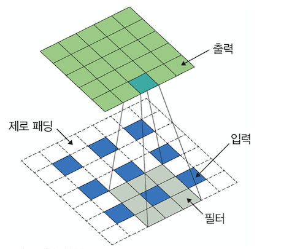

# Image Segmentation
> 이미지 분할은 신경망을 훈련시켜 이미지를 픽셀 단위로 분할하는 것이다.
> 이미지를 픽셀 단위로 분할하여 이미지에 포함된 객체를 추출한다.
>
> 대표적 네트워크로는 `완전 합성곱 네트워크`,`합성곱 & 역합성곱 네트워크`,`U-Net`,`PSPNet`,`DeepLabv3/DeepLabv3+`등이 있다.

## 완전 합성곱 네트워크
> FC층의 한계는 고정된 크기의 입력만 받아들이며, **FC층을 거친 후에는 위치 정보가 사라진다.**
> 이러한 문제를 해결하기 위해 __FC층을 1*1 합성곱으로 대체하는 것이__ 완전 합성곱 네트워크이다.
- 이렇게 되면 입력 이미지에 대한 크기 제약이 사라지는 장점이 있다.
---
## 합성곱 & 역합성곱 네트워크
> 완전 합성곱 네트워크에는 문제점이 있다.
>  - 여러 단계의 합성곱층과 풀링층을 거치면서 해상도가 낮아진다.
>  - 낮아진 해상도를 복원하기 위해 업 샘플링 방식을 사용하기 때문에 이미지의 세부 정보들을 잃어버리는 문제가 발생한다.
> 이러한 문제를 해결하기 위해 역합성곱 네트워크를 도입한 것이 합성곱 & 역합성곱 네트워크이다.
### 역합성곱 이란?
> 역합성곱은 cnn의 최종 출력 결과를 입력 이미지와 같은 크기로 만들고 싶을 때 사용한다.
> 시멘틱 분할등에 활용할 수 있으며, 역 합성곱을 `업 샘플링`이라고도 합니다.

- 각각의 픽셀 주위에 제로 패딩 추가
- 그것에 합성곱 연산 수행 

  

- 파란색 픽셀 주위로 흰색 제로 패딩을 수행하고, 회색 필터로 합성곱 연산을 수행하면 초록색이 출력 된다.
---
## U-Net
> 보통 바이오 메디컬 이미지 분할에서 사용한다.

- 속도가 빠르다.
  - 기존 슬라이딩 윈도우 방식은 이전 패치에서 검증이 끝난 부분을 다시 검증해서 속도가 느렸다. 하지만 U-Net은 검증이 끝난 패치는 건너뛰기 때문에 속도가 빠르다.
- 트레이드오프에 빠지지 않는다.
  - 일반적으로 패치 크기가 커지면 넓은 범위 이미지 인식(컨텍스트 인식)에는 탁월하지만 지역화에는 한계가 있다. 하지만 U-Net은 컨텍스트 인식과 지역화 이 둘 트레이드오프 문제를 개선하였다.

### U-Net의 구조
- FCN을 기반으로 구축
- `수축 경로`와 `확장 경로`로 구성되어 있다.
  - `수축 경로`는 컨텍스트를 포착
  - `확장 경로`는 특성 맵을 업 샘플링하고, `수축 경로`에서 포착한 특성 맵의 컨텍스트와 결합하여 정확한 지역화를 수행한다.
- 다운 샘플링과 업 샘플링을 순서대로 반복하는 구조로 되어있다.
  - 크기가 다양한 이미지의 객체를 분할하기 위해 크기가 다양한 특성 맵을 병합할 수 있기 위해
---
## PSPNet
> FC층의 한계를 극복하기 위해 피라미드 풀링 모듈을 추가했다.
>   - 이미지 출력이 서로 다른 크기가 되도록 여러 차례 풀링을 한다.
>     - 각각 다른 크기의 특성 맵은 서로 다른 영역들의 정보를 담는다.
>   - 1*1 합성곱을 사용하여 채널 수를 조정한다.
>     - 풀링층 개수가 N이라고 할 때 `출력 채널 수 = 입력 채널 수 / N`
>   - 이후 모듈의 입력 크기에 맞게 업 샘플링 (양선형 보간법)
>   - 1~3 병합
### 양선형 보간법
- 화소당 선형 보간을 세 번 수행하며, 새롭게 생성된 화소는 가장 가까운 화소 네 개에 가중치를 곱한 값을 합해서 얻습니다.
---
## DeepLabv3/DeepLabv3+
> FC층의 단점을 보완하기 위해 `Atrous 합성곱`을 사용하는 네트워크이다. `인코더/디코더` 구조를 가지며, 인코더에서 추출된 특성 맵의 해상도를 `Atrous 합성곱`을 도입하여 제어할 수 있도록 했다.
### Atrous 합성곱
- 필터 내부에 빈 공간을 둔 채로 작동한다.
- rate 별로 얼마나 많은 빈 공간을 가질지 결정한다. (r이 커질수록 빈 공간은 더 많아진다.)
- 이미지 분할에서 높은 성능을 내려면 수용 영역의 크기가 중요한데, 수용 영역을 확대하여 특성을 찾는 범위를 높게 해준다. 더구나 파라미터 수를 늘리지 않으면서도 수용 영역을 크게 키울 수 있기 때문에 이미지 분할 분야에서 많이 사용한다.
  - 수용 영역이란 전체 영역에 대해 서로 동일한 중요도를 부여하여 처리하는 대신, 특정 범위를 한정해서 처리하여 효과적으로 훈련을 수행하는 것이 수용 영역이다. (특정 위치의 픽셀은 거리가 멀어질수록 그 영향은 감소하게 된다.)